# LMDB

LMDB (Lightning Memory-Mapped Database) - это встраиваемая key-value база данных, основанная на B+-деревьях. Она полностью ACID-транзакционная. Основная особенность LMDB заключается в том, что она использует отображённые в память файлы в качестве механизма работы с диском и синхронизации внутренних структур данных. Это означает, что поддержание консистентности данных в хранилище при работе с ним из нескольких процессов становится обязанностью ОС. Отсутствие кешей полностью избавляет LMDB от накладных расходов, связанных с динамическими аллокациями. LMDB использует copy-on-write подход при записи данных; читатели не блокируют писателей, писатели не блокируют читателей, и читатели не блокируют читателей. Система позволяет иметь столько же версий данных в любое время, сколько есть транзакций (many read, one write).

## История LMDB

Дизайн LMDB впервые был обсужден в сообщении 2009 года в списке рассылки разработчиков OpenLDAP в контексте поиска решений проблем с управлением кэшем, вызванных зависимостью проекта от BerkeleyDB. Конкретная цель состояла в том, чтобы заменить множество уровней настройки и кэширования, присущих дизайну BerkeleyDB, единым, автоматически управляемым кэшем под управлением операционной системы хоста.

Впоследствии началась разработка, первоначально как ответвление аналогичной реализации от проекта OpenBSD ldapd. Первая общедоступная версия появилась в репозитории исходных текстов OpenLDAP в июне 2011 года. До ноября 2012 года проект был известен как MDB, после чего был переименован в LMDB, чтобы избежать конфликтов с существующим программным обеспечением. LMDB быстро завоевала популярность благодаря своей простоте, скорости и эффективному использованию памяти. Она стала популярным выбором для множества приложений, особенно тех, где есть высокие требования к производительности.

## Инструменты для взаимодействия с LMDB

LMDB предоставляет API на языке C для взаимодействия с базой данных. Также доступны обертки для различных языков программирования, например для C++, Java, Python, Go, Ruby… Список всех ЯП, для которых реализовано API, доступен по [ссылке](www.symas.com/symas-lmdb-tech-info).

## Какой database engine используется в LMDB?

LMDB сама является database engine’ом, она представляет собой встроенную транзакционную базу данных в виде хранилища ключей и значений.
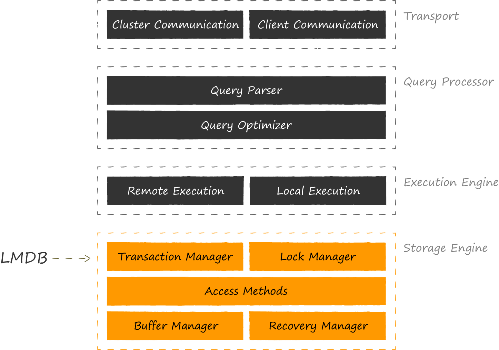

## Как устроен язык запросов в LMDB?

LMDB не имеет традиционного языка запросов, такого как SQL, но вместо этого предоставляет простой и эффективный способ хранения и извлечения данных с помощью ключей.

В LMDB каждая часть данных хранится как пара ключ-значение. Ключ - это уникальный идентификатор для данных, а значение - это сами данные. Оба ключи и значения - это массивы байтов, что означает, что они могут быть любыми двоичными данными, включая строки, целые числа и т.д.

LMDB предоставляет следующие операции для взаимодействия с базой данных:
- Put: вставить или обновить пару ключ-значение.
- Get: извлечь значение по его ключу.
- Delete: удалить пару ключ-значение.
- Cursor: итерировать по диапазону пар ключ-значение.

Рассмотрим операции CRUD в LMDB на примере пакета lmdb в python.

CREATE

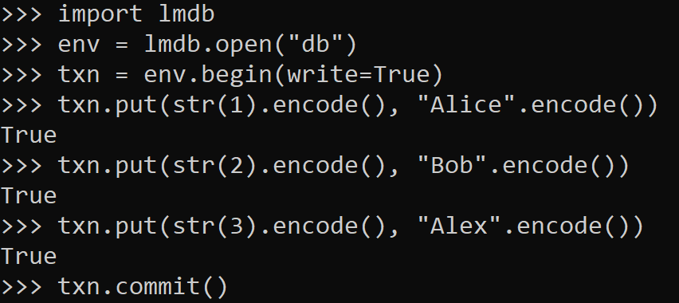

READ

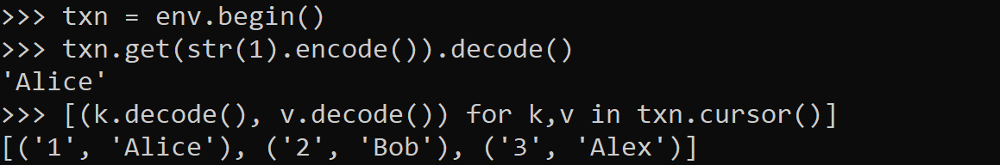

UPDATE

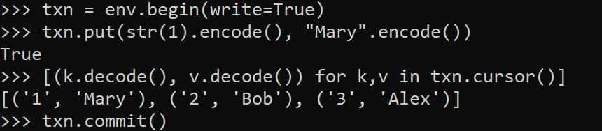

DELETE

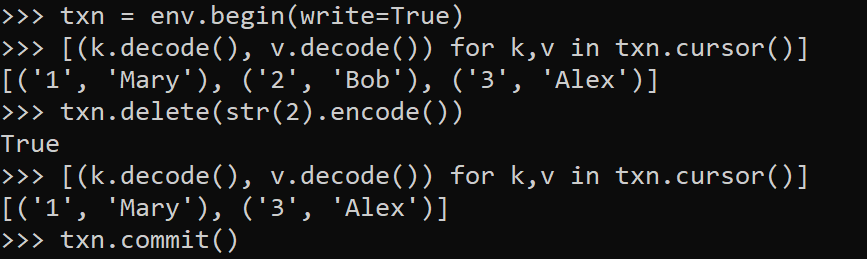

## Распределение файлов по разным носителям?

LMDB сама по себе не обеспечивает встроенной поддержки распределения файлов базы данных по разным носителям, поскольку ее основной целью является обеспечение высокой производительности и низкой задержки при доступе к данным. Данные хранятся в виде B+-tree структуры.

## На каком языке/ах программирования написана LMDB?

LMDB написана на языке C

## g.	Какие типы индексов поддерживаются в LMDB? 

LMDB не поддерживает индексы "из коробки", но существуют надстройки над LMDB, поддерживающие индексы, например [lmdb-index](https://github.com/anywhichway/lmdb-index/)

## Как строится процесс выполнения запросов в LMDB?

Запросы выполняются в следующем порядке:

1. **Открытие базы данных**: Процесс начинается с открытия базы данных с помощью функции `mdb_env_open()` для создания окружения базы данных и `mdb_dbi_open()` для открытия самой базы данных.
2. **Начало транзакции**: Для выполнения любых операций с базой данных необходимо начать транзакцию с помощью функции `mdb_txn_begin()`. 
3. **Исполнение запросов**: Внутри транзакции можно выполнять различные операции с базой данных, такие как вставка (`mdb_put()`), извлечение (`mdb_get()`), удаление (`mdb_del()`), а также выполнение запросов с помощью курсоров (`mdb_cursor_open()`, `mdb_cursor_get()`, `mdb_cursor_put()`, и так далее).
4. **Завершение транзакции**: После выполнения всех запросов транзакция завершается с помощью функции `mdb_txn_commit()` для сохранения изменений в базе данных или `mdb_txn_abort()` для отката всех изменений.
5. **Закрытие базы данных**: После завершения всех операций с базой данных ее можно закрыть с помощью функции `mdb_dbi_close()`.
6. **Закрытие окружения базы данных**: Наконец, окружение базы данных закрывается с помощью функции `mdb_env_close()`.

Это общий процесс выполнения запросов в LMDB. Каждый запрос выполняется в контексте транзакции для обеспечения согласованности данных.

## Есть ли для LMDB понятие «план запросов»?

В LMDB запросы выполняются напрямую через API базы данных без использования языка запросов подобного SQL, и, следовательно, нет необходимости в плане запроса

## Поддерживаются ли транзакции в LMDB?

Да, LMDB поддерживает транзакции. В LMDB есть поддержка всех базовых свойств ACID: атомарность, консистентность, изолированность и надёжность. Подход к многопоточности описывается схемой «single writer / multiple readers». Писатели блокируют друг друга, но не блокируют читателей. Читатели не блокируют ни писателей, ни друг друга. Реализованы поддержка вложенных транзакций и поддержка мультиверсионности (каждая транзакция работает именно с той версией базы данных, которая была актуальна на момент её открытия, будучи полностью изолированной от всех последующих изменений).

Краткое описание транзакций в LMDB:
1. **Начало транзакции**: Процесс начинается с вызова функции `mdb_txn_begin()` для начала новой транзакции. При этом фиксируется версия базы данных, актуальная на данный момент, для обеспечения изоляции транзакции от других одновременно выполняемых транзакций.
2. **Исполнение операций**: После начала транзакции можно выполнять операции чтения и записи данных в базе данных с помощью функций API LMDB, таких как `mdb_put()`, `mdb_get()`, `mdb_del()`, и других. Все операции выполняются в контексте данной транзакции.
3. **Завершение транзакции**: По завершении всех операций транзакция завершается с помощью вызова `mdb_txn_commit()` для фиксации изменений в базе данных. Это применяет все изменения, сделанные в транзакции, к базе данных и освобождает блокировку.
4. **Отмена транзакции**: В случае необходимости можно отменить транзакцию, вызвав `mdb_txn_abort()`. Это откатывает все изменения, сделанные в рамках транзакции.

## Какие методы восстановления поддерживаются в LMDB

LMDB в качестве механизма обеспечения устойчивости использует copy-on-write подход. Его суть в том, что вместо обновления данных на существующей странице LMDB сначала целиком её копирует и все модификации производит уже в копии.
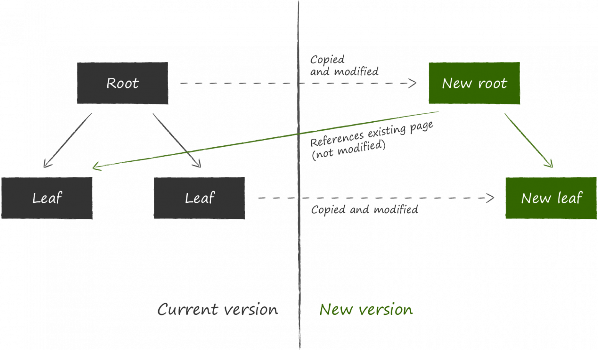
Далее, чтобы обновленные данные были доступны, необходимо изменить ссылку на ставший актуальным узел в родительском по отношению к нему узле. Поскольку для этого его тоже нужно модифицировать, он тоже предварительно копируется. Процесс продолжается рекурсивно до самого корня. Последними меняются данные на мета-странице. 
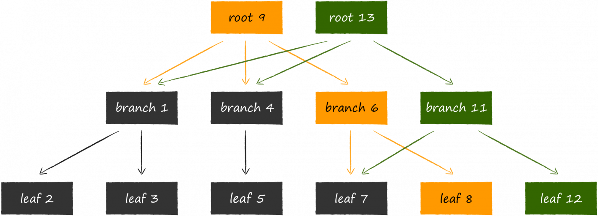
Если вдруг во время процедуры обновления произойдет аварийное завершение процесса, то либо не создастся новая мета-страница, либо она не будет записана на диск до конца, и её контрольная сумма будет некорректной. В любом из этих двух случаев новые страницы будут недостижимы, а старые не пострадают. Это избавляет LMDB от необходимости вести write ahead log для поддержания консистентности данных. Отсутствие лога транзакций в явном виде — одна из фишек LMDB, обеспечивающая высокую скорость чтения данных.
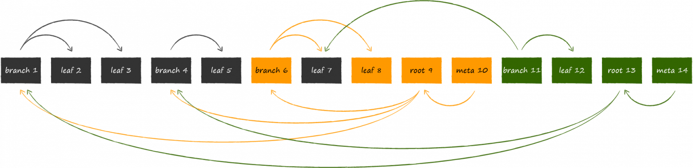
Получившаяся конструкция естественным образом обеспечивает изоляцию транзакций и мультиверсионность. В LMDB с каждой открытой транзакцией ассоциируется актуальный на данный момент корень дерева. До тех пор, пока транзакция не завершена, страницы связанного с ней дерева никогда не будут изменены или повторно использованы под новые версии данных. Таким образом, можно сколь угодно долго работать ровно с тем набором данных, который был актуален на момент открытия транзакции, даже если хранилище в это время продолжает активно обновляться. Оборотной стороной медали является потенциально значительно больший расход виртуальной памяти.

## Расскажите про шардинг в LMDB

В LMDB данные изначально сбалансированы, т.к. они структурированы в B+-дерево - сильноветвящееся сбалансированное дерево поиска, позволяющее проводить поиск, добавление и удаление элементов за O(logn),  вся информация хранится в листьях, а во внутренних узлах хранятся только копии ключей.

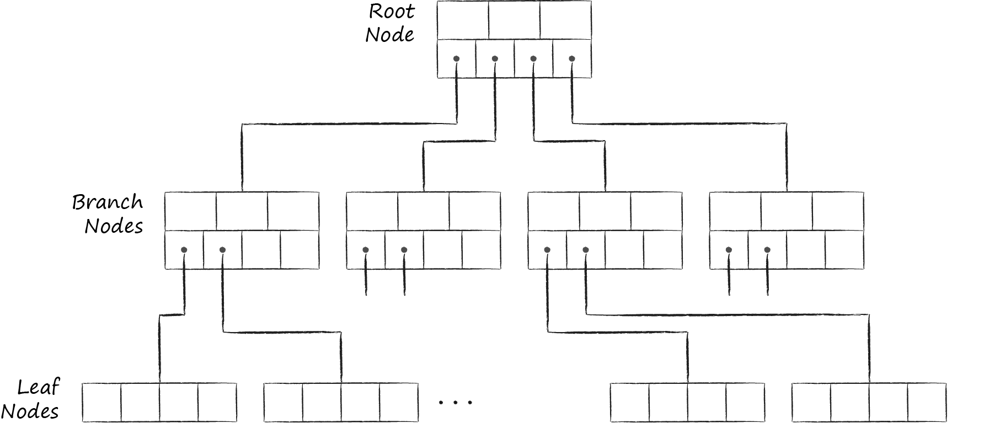

Внутри одного инстанса LMDB можно создавать несколько баз данных, разделяющих между собой замапленное виртуальное адресное пространство. Каждая из них начинается со своего собственного корня.
Физически узлы — это блоки памяти заранее определенной длины. Их размер кратен размеру страниц памяти в операционной системе. Ниже отображена структура узла. В хедере находится метаинформация, самая очевидная из которых для примера — это контрольная сумма. Далее идет информация об офсетах, по которым располагаются ячейки с данными.

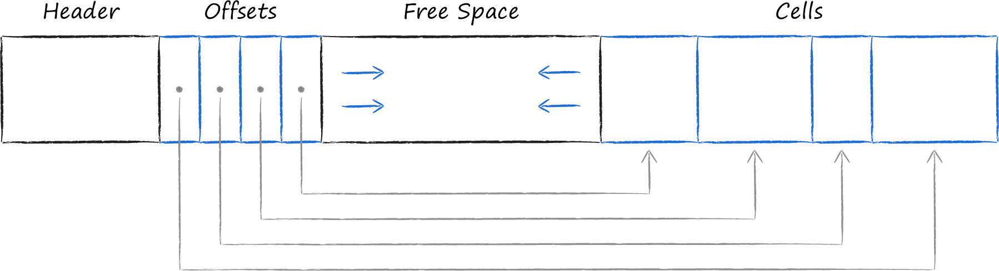

Дерево схематично:

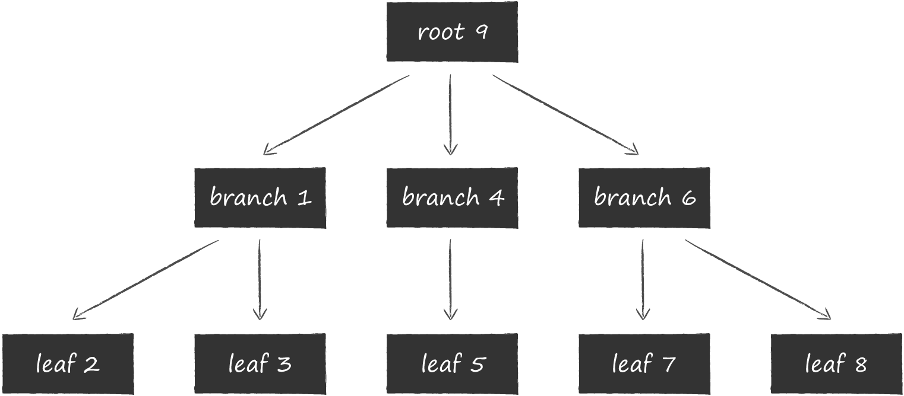

Страницы с узлами последовательно располагаются на диске. Так называемая мета-страница (meta page) содержит информацию о смещениях, по которым можно найти корни всех деревьев. При открытии файла LMDB постранично сканирует файл в поисках валидной мета-страницы и уже через неё находит существующие базы данных.​

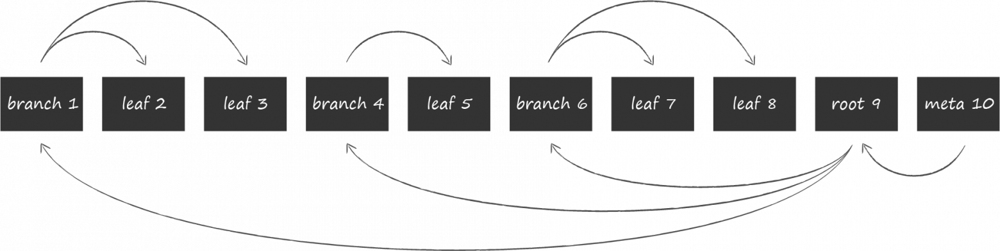

## Возможно ли применить термины Data Mining, Data Warehousing и OLAP в LMDB?

LMDB, как key-value база данных, предназначена для операций с хранением и эффективным извлечением данных и не предназначена для аналитических операций, таких как Data Mining, Data Warehousing и OLAP (Online Analytical Processing).

## Какие методы защиты поддерживаются LMDB?

LMDB не включает в себя встроенное шифрование данных. Однако можно самостоятельно обеспечить шифрование данных перед сохранением их в базе данных. Это может быть достигнуто с использованием сторонних инструментов для шифрования данных перед сохранением их в LMDB или с использованием шифрования на уровне приложения. Аналогично и с механизмами для управления доступом: можно использовать авторизацию на уровне приложения.

## Какие сообщества развивают LMDB? Кто в проекте имеет права на коммит и создание дистрибутива версий?

LMDB – open-source проект, разрабатывается компанией Symas, точнее ее дочерней организацией OpenLDAP Project. В основном коммиты делает главный архитектор компании, Говард Чу, создатель LMDB, но также коммиты иногда делают другие работники компании. Авторизоваться и предложить исправление кода может каждый, для этого необходимо зарегистрироваться по ссылке [ссылке](https://bugs.openldap.org/createaccount.cgi), а затем войти в [гитлаб](https://git.openldap.org/openldap/openldap/-/tree/mdb.master) проекта

## Создайте свои собственные данные для демонстрации работы СУБД. Как продолжить самостоятельное изучение языка запросов с помощью демобазы. Если демобазы нет, то создайте ее.

Данные (демобаза) представлены в папке demo_db. Примеры работы СУБД в ответах выше. Языка запроса нет, поэтому изучать нужно API на удобном ЯП.

## Где найти документацию и пройти обучение. Как быть в курсе происходящего

[официальная документация](http://www.lmdb.tech/doc/), здесь же можно посмотреть [основы](http://www.lmdb.tech/doc/starting.html)

[доки для питоновской библиотеки](https://lmdb.readthedocs.io/en/release/)

[отслеживать изменения можно в ветке гилаба](https://git.openldap.org/openldap/openldap/-/tree/mdb.RE/0.9)

[пример создания бд и запросов к ней](https://www.programmerall.com/article/1704206952/)

